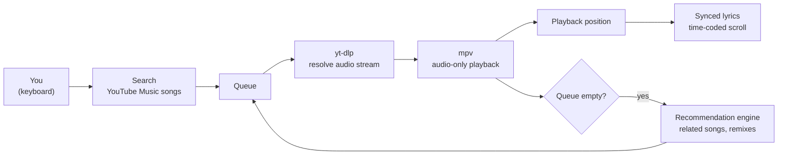

<div align="center">

# Ly-ric


> A terminal-based YouTube Music player with synced lyrics, radio-style autoplay,
> and vim-style controls. No browser. No tabs. Just music.

</div>

<p align="center">
  
  
</p>

## Overview

Lyric is a terminal-based YouTube Music player. It searches songs (never random
videos), streams them audio-only through mpv, scrolls time-coded lyrics in sync
with playback, and — when your queue runs dry — keeps the music going by
auto-queuing related songs from YouTube Music's recommendation engine.

Everything happens inside one full-screen terminal UI driven entirely by the
keyboard, with vim-style bindings. Built with Python, mpv, and yt-dlp.

## Why a Terminal Music Player

Every way of listening to YouTube Music on a desktop asks you to give something
up:

| Approach | What it costs you |
| --- | --- |
| Browser tab | Hundreds of megabytes of RAM, video decode for audio you never watch, and lyrics in a second tab you have to keep switching to |
| Official web player | Mouse-driven, heavyweight, and pauses the moment you close the tab |
| Generic terminal players | Local files only — no YouTube catalog, no recommendations, no lyrics |

This player trades all of that for one terminal window: keyboard-only control,
audio-only streaming, lyrics in the same pane as playback, and a radio queue
that runs itself. It also runs happily over SSH — your music follows you into
any remote session.

## Features

| Feature | What it does |
| --- | --- |
| Songs-only search | Queries YouTube Music and returns songs — no random videos, covers, or 10-hour mixes |
| Audio-only streaming | Streams via mpv, pulling the audio track only — lightweight on bandwidth, no video decode |
| Synced lyrics | Time-coded lyrics scroll in sync with playback; falls back to plain static lyrics when synced ones are unavailable |
| Radio queue | When the queue empties, related songs (same artist, other artists, remixes) are auto-queued — endless radio |
| Full playback control | Next, previous, replay, seek, and pause, all from the keyboard |
| Full-screen terminal UI | One pane for search, playback, and lyrics — nothing else on screen |

## Quick Start

After completing [Installation](#installation):

```bash
python3 main.py
```

Search a song, press Enter, and walk away — the radio keeps playing.

## Table of Contents

- [Overview](#overview)
- [Why a Terminal Music Player](#why-a-terminal-music-player)
- [Features](#features)
- [How It Works](#how-it-works)
- [The Radio Queue](#the-radio-queue)
- [Synced Lyrics](#synced-lyrics)
- [Keyboard Controls](#keyboard-controls)
- [Tech Stack](#tech-stack)
- [Project Structure](#project-structure)
- [Installation](#installation)
- [Usage](#usage)
- [Troubleshooting](#troubleshooting)
- [Limitations and Scope](#limitations-and-scope)
- [Roadmap](#roadmap)
- [Contributing](#contributing)
- [License](#license)

## How It Works

Each stage of playback is delegated to the tool built for it:



| Stage | Responsibility |
| --- | --- |
| Search | Queries YouTube Music with a songs-only filter, so results are tracks — not videos that happen to contain the song's name |
| Stream resolution | yt-dlp resolves the audio-only stream URL for the selected track |
| Playback | mpv plays it — a battle-tested audio engine, so the Python layer never touches audio decoding itself |
| Lyrics | Time-coded lyrics scroll against the live playback position read from mpv |
| Radio | When the queue runs dry, the recommendation engine appends related tracks |

The division of labor is the design: Python orchestrates, mpv plays, yt-dlp
resolves, YouTube Music recommends. No component does another's job.

## The Radio Queue

Pick one song and the player keeps going. When the queue empties, YouTube
Music's recommendation engine supplies the next tracks — same artist, related
artists, remixes. The result behaves like a radio station that started from the
song you actually wanted, rather than an algorithm's guess about your mood.

You never leave the terminal to keep the music playing, and skipping is always
one keypress away.

## Synced Lyrics

For tracks that have them, lyrics are time-coded: the active line highlights
and scrolls in sync with the playback position streamed from mpv, karaoke
style. When synced lyrics are unavailable, the player falls back to plain
lyrics — the full text, statically displayed — rather than showing nothing.

Either way, the lyrics live in the same pane as playback. No second tab, no
context switch, no copying a song title into a search engine.

## Keyboard Controls

Vim-style bindings throughout. The defaults:

| Key | Action |
| --- | --- |
| `/` | Search |
| `j` / `k` | Move down / up the list |
| `Enter` | Play selected track |
| `Space` | Pause / resume |
| `n` | Next track |
| `p` | Previous track |
| `r` | Replay from the start |
| `h` / `l` | Seek backward / forward |
| `q` | Quit |

Press `?` in-app for the live binding list.

## Tech Stack

| Layer | Technology |
| --- | --- |
| Language | Python 3.9+ |
| Audio playback | mpv (audio-only streaming) |
| Stream resolution | yt-dlp |
| Catalog and recommendations | YouTube Music |
| Interface | Full-screen terminal UI with vim-style controls |

## Project Structure

```text
Ly-ric/
├── requirements.txt          # Python dependencies
├── README.md
└── src/
    ├── main.py               # Entry point: launches the full-screen UI
    ├── search.py             # YouTube Music songs-only search
    ├── player.py             # mpv process control, playback position
    ├── lyrics.py             # Synced and plain lyric fetching/display
    └── radio.py              # Recommendation-driven queue extension
```

File names are representative of the responsibilities — adjust to match your
repository's actual layout.

## Installation

### 1. System Dependencies

mpv and yt-dlp do the audio heavy lifting and must be installed outside pip:

```bash
# Debian / Ubuntu
sudo apt install mpv

# macOS
brew install mpv

# Arch
sudo pacman -S mpv
```

```bash
pip install -U yt-dlp
```

On Windows, mpv is available via `winget install mpv` or Scoop.

### 2. Clone and Set Up

```bash
git clone https://github.com/sam-k99/Ly-ric.git
cd Ly-ric
python3 -m venv venv
source venv/bin/activate
pip install -r requirements.txt
```

### 3. Run

```bash
python3 main.py
```

## Usage

### A First Session

Abridged and illustrative — exact wording varies by version:

```text
$ python3 main.py

  search> fleetwood mac dreams
  1.  Dreams (Remaster 2004)        Fleetwood Mac        4:19
  2.  Dreams                        Fleetwood Mac        4:18
  3.  Dreams — Live                 Fleetwood Mac        5:04
  ...

  ▶ Dreams — Fleetwood Mac                     [2:31 / 4:18]

      Now here you go again, you say
      you want your freedom...          <- scrolls in sync

  radio: queue low — added 3 related tracks
```

Type a search, pick a track, and the lyrics follow the music line by line.
When the queue runs low, the radio quietly refills it. Playback never stops
because you stopped typing.

### Navigation

- Search with `/`, play with `Enter`, and navigate results with `j`/`k`
- Skip with `n`, rewind with `p`, scrub with `h`/`l`
- Quit with `q` — or don't; the radio is happy to run all day

## Troubleshooting

- **`mpv not found`.** Install it with your package manager — see
  [Installation](#installation). It is a system dependency, not a pip package.
- **Playback suddenly broke on tracks that worked yesterday.** YouTube
  periodically changes how streams are exposed, and yt-dlp releases follow.
  Update it: `pip install -U yt-dlp`. This is the single most common fix for
  this class of player.
- **No lyrics for a track.** Not every song has synced lyrics; the player
  falls back to plain lyrics, and some tracks have neither.
- **Search returns nothing.** Some catalogs differ by region; try a broader
  query or check your network.
- **UI looks cramped or cut off.** The full-screen interface needs a
  reasonably sized terminal — widen the window.

## Limitations and Scope

- Streaming depends on yt-dlp's stream extraction, which YouTube changes
  periodically — keep it updated.
- Search is songs-only by design; album and video results are deliberately
  out of scope.
- Recommendation quality comes from YouTube Music's engine, not from anything
  this project controls.
- There is no offline caching; playback requires a connection.
- Intended for personal use.


<div align="center">

Thanks for stopping by 

</div>
